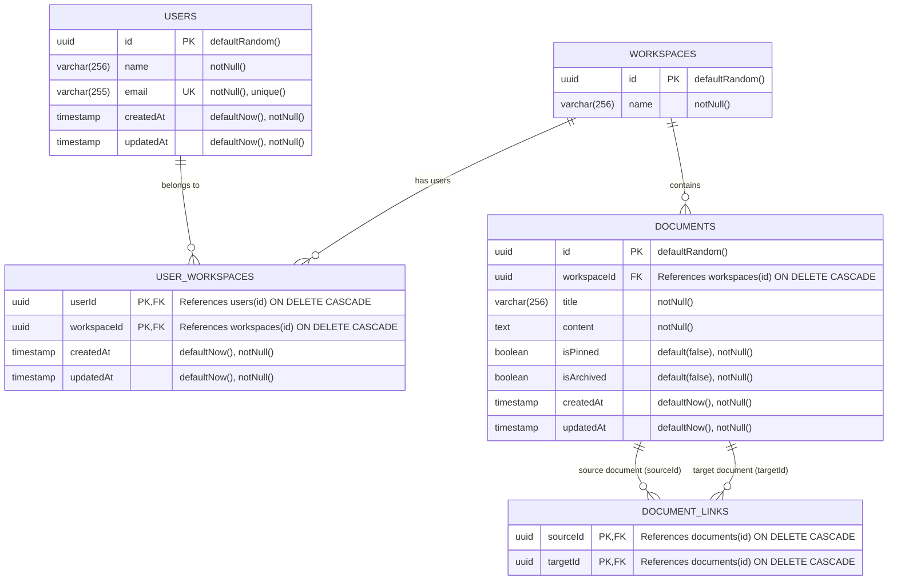

# Notion + Obsidian Hybrid Architecture & Specification

## Overview
A Notion-like notes workspace with an **Obsidian-style Knowledge Graph**, built with:
- **Framework**: Next.js 16 (App Router) + React 19
- **Database & ORM**: PostgreSQL + Drizzle ORM
- **API**: tRPC v11
- **Styling**: Tailwind CSS v4
- **Graph Visualization**: `react-force-graph-2d` (Canvas Force Simulation)

---

## 1. Database Schema (as defined in `src/server/db/schema.ts`)

### Entity-Relationship Diagram



### Exact Table Definitions & Constraints

1. **`users` (`final-notes-app_users`)**:
   - `id`: `uuid` Primary Key, auto-generated with `defaultRandom()`
   - `name`: `varchar(256)` (Not Null)
   - `email`: `varchar(255)` (Not Null, Unique)
   - `createdAt`: `timestamp with timezone` (Not Null, `defaultNow()`)
   - `updatedAt`: `timestamp with timezone` (Not Null, `defaultNow()`, updated via `$onUpdate`)

2. **`workspaces` (`final-notes-app_workspaces`)**:
   - `id`: `uuid` Primary Key, auto-generated with `defaultRandom()`
   - `name`: `varchar(256)` (Not Null)

3. **`user_workspaces` (`final-notes-app_user_workspaces`)**:
   - `userId`: `uuid` (Not Null, references `users.id` with `onDelete: "cascade"`)
   - `workspaceId`: `uuid` (Not Null, references `workspaces.id` with `onDelete: "cascade"`)
   - `createdAt`: `timestamp with timezone` (Not Null, `defaultNow()`)
   - `updatedAt`: `timestamp with timezone` (Not Null, `defaultNow()`, updated via `$onUpdate`)
   - **Primary Key**: Composite `(userId, workspaceId)`

4. **`documents` (`final-notes-app_documents`)**:
   - `id`: `uuid` Primary Key, auto-generated with `defaultRandom()`
   - `workspaceId`: `uuid` (Not Null, references `workspaces.id` with `onDelete: "cascade"`)
   - `title`: `varchar(256)` (Not Null)
   - `content`: `text` (Not Null)
   - `isPinned`: `boolean` (Not Null, default `false`)
   - `isArchived`: `boolean` (Not Null, default `false`)
   - `createdAt`: `timestamp with timezone` (Not Null, `defaultNow()`)
   - `updatedAt`: `timestamp with timezone` (Not Null, `defaultNow()`, updated via `$onUpdate`)
   - **Indexes**:
     - `documents_workspaceId_idx`: index on `(workspaceId)`
     - `documents_workspaceId_title_idx`: unique index on `(workspaceId, title)` (guarantees unique document titles per workspace for exact Wiki-Link `[[Title]]` resolution)

5. **`document_links` (`final-notes-app_document_links`)**:
   - `sourceId`: `uuid` (Not Null, references `documents.id` with `onDelete: "cascade"`)
   - `targetId`: `uuid` (Not Null, references `documents.id` with `onDelete: "cascade"`)
   - **Primary Key**: Composite `(sourceId, targetId)`
   - **Index**: `document_links_targetId_idx` on `(targetId)` (for instant $O(1)$ reverse backlink lookups)

---

## 2. In-Memory Knowledge Graph Engine

### Purpose
Provides fast graph traversals, backlink indexing, and local neighborhood discovery for the interactive Obsidian-style graph view.

### Class Architecture (`src/server/graph/document-graph.ts`)

```typescript
export interface GraphNode {
  id: string;
  title: string;
  isPinned: boolean;
  val: number; // Node weight / degree (number of connections)
}

export interface GraphEdge {
  source: string; // sourceId
  target: string; // targetId
}

export class DocumentGraph {
  private nodes = new Map<string, GraphNode>();
  private forwardAdj = new Map<string, Set<string>>(); // sourceId -> Set<targetId>
  private backwardAdj = new Map<string, Set<string>>(); // targetId -> Set<sourceId>

  // 1. O(1) Backlinks Lookup (documents that link to targetId)
  getBacklinks(targetId: string): GraphNode[]

  // 2. O(1) Forward Links Lookup (documents that sourceId links to)
  getForwardLinks(sourceId: string): GraphNode[]

  // 3. Local Subgraph (k-hop Neighborhood for active document)
  getLocalSubgraph(documentId: string, depth: number = 1): { nodes: GraphNode[]; links: GraphEdge[] }

  // 4. Global Workspace Graph (for full Obsidian 2D force-directed canvas)
  toForceGraphData(): { nodes: GraphNode[]; links: GraphEdge[] }
}
```

---

## 3. Automatic Wiki-Link & Markdown Link Extraction

When saving or updating a document:
1. Regex scanner searches markdown `content` for:
   - Wiki-links: `[[Target Document Title]]`
   - Markdown links: `[Title](/documents/target-uuid)`
2. Resolves target document IDs using the unique `(workspaceId, title)` index.
3. Automatically syncs `document_links` table rows:
   - Inserts `(sourceId, targetId)` pairs.
   - Deletes removed links in a Drizzle transaction.
4. Updates the in-memory graph instance in $O(1)$ time.

---

## 4. API Endpoints (tRPC Router)

| Router | Procedure | Type | Input | Description |
|---|---|---|---|---|
| `documents` | `list` | Query | `{ workspaceId: string }` | Returns all active documents in a workspace. |
| `documents` | `getById` | Query | `{ id: string }` | Returns document details and content. |
| `documents` | `create` | Mutation | `{ workspaceId: string; title: string; content?: string }` | Creates a new document. |
| `documents` | `update` | Mutation | `{ id: string; title?: string; content?: string; isPinned?: boolean; isArchived?: boolean }` | Updates document content, metadata, and auto-syncs links. |
| `documents` | `delete` | Mutation | `{ id: string }` | Deletes document (cascades to `document_links`). |
| `graph` | `getLocalGraph` | Query | `{ documentId: string; depth?: number }` | Returns $k$-hop neighborhood for the active note widget. |
| `graph` | `getBacklinks` | Query | `{ documentId: string }` | Returns all documents pointing to this document. |
| `graph` | `getGlobalGraph` | Query | `{ workspaceId: string }` | Returns all workspace nodes and edges for 2D Canvas. |

---

## 5. Frontend Graph Visualization (`react-force-graph-2d`)

- **Component**: `<DocumentGraphView data={graphData} onNodeClick={navigate} />`
- **Features**:
  - Interactive force-directed physics (drag, zoom, pan).
  - Dynamic node radius proportional to number of backlinks.
  - Hover tooltips showing document title and connection count.
  - Click node to navigate to `/documents/[id]`.
